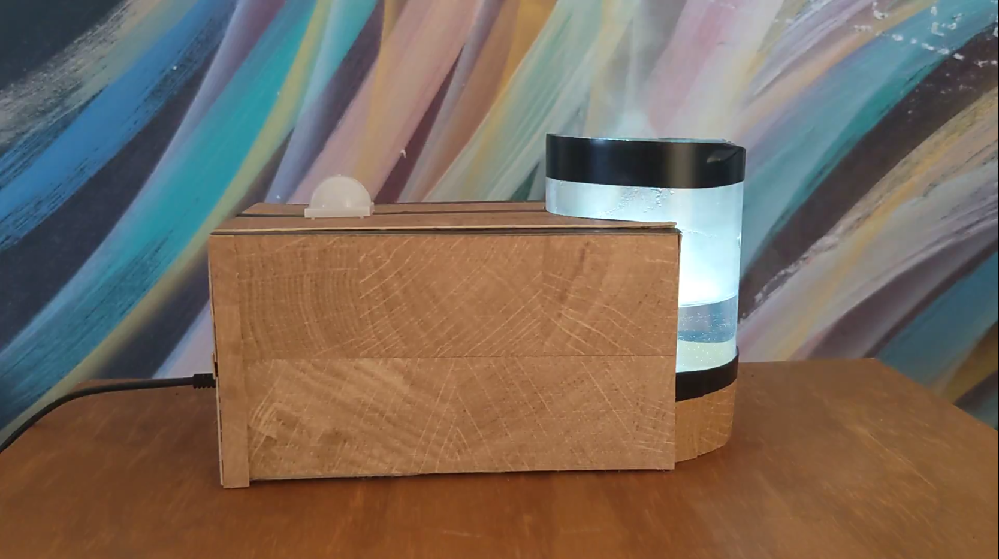
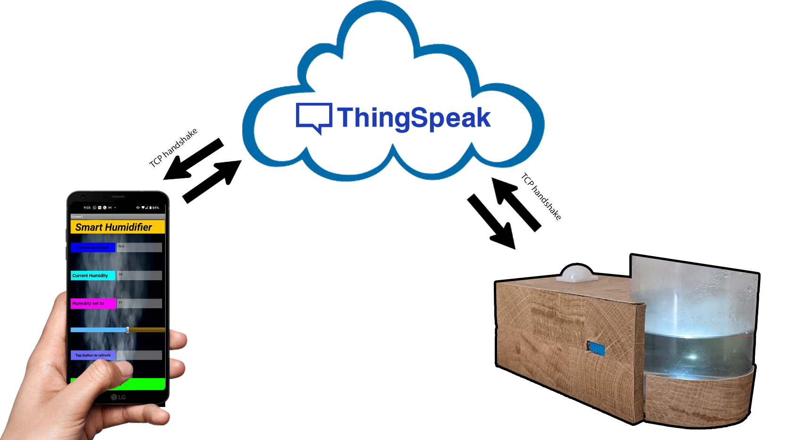
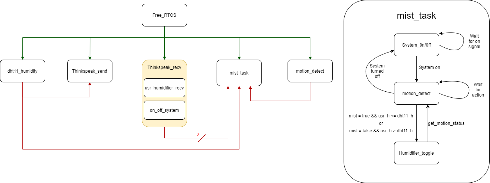

# IOT_based_humidifier
The humidifier built employs a STM-32 bluepill microcontroller as the main driver circuit. It communicates with ESP 8266 module to send and receieve data to and from thinkspeak server through WIFI. Firmware uses Free RTOS kernel to schedule tasks.

*_Features_*
- Motion Detection : The system has PIR sensor to detect motion in the room. If it senses no motion in the room, it turns off the device to save power.
- Humidity sensor : The Sensor gives realtime data to the controller. When the humidity is less than what user has set to, it turns on the humidifier. Else it turns off the humidifier if its already on.
- Water level detector : It senses the water remaining in the humidifier and notifies the user to fill it if its emptying. 

Below is the block diagram of the system -

Firmware Block Diagram -

